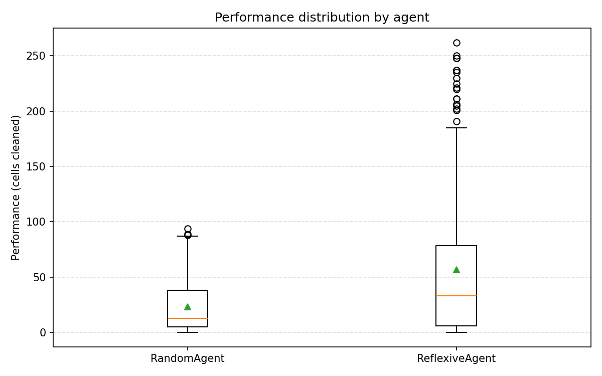
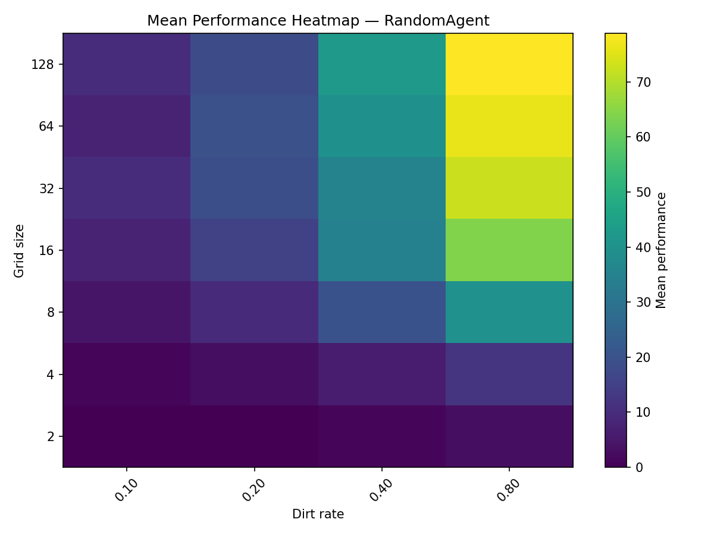
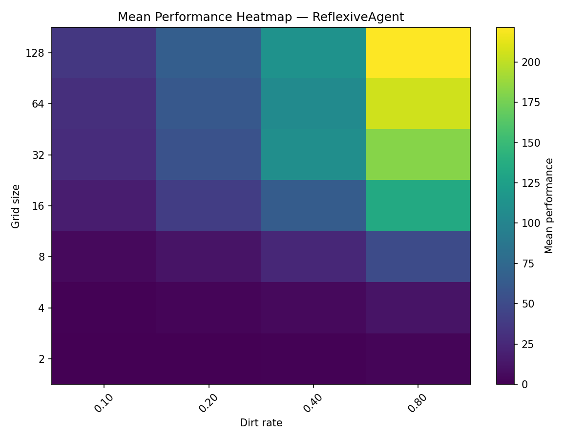
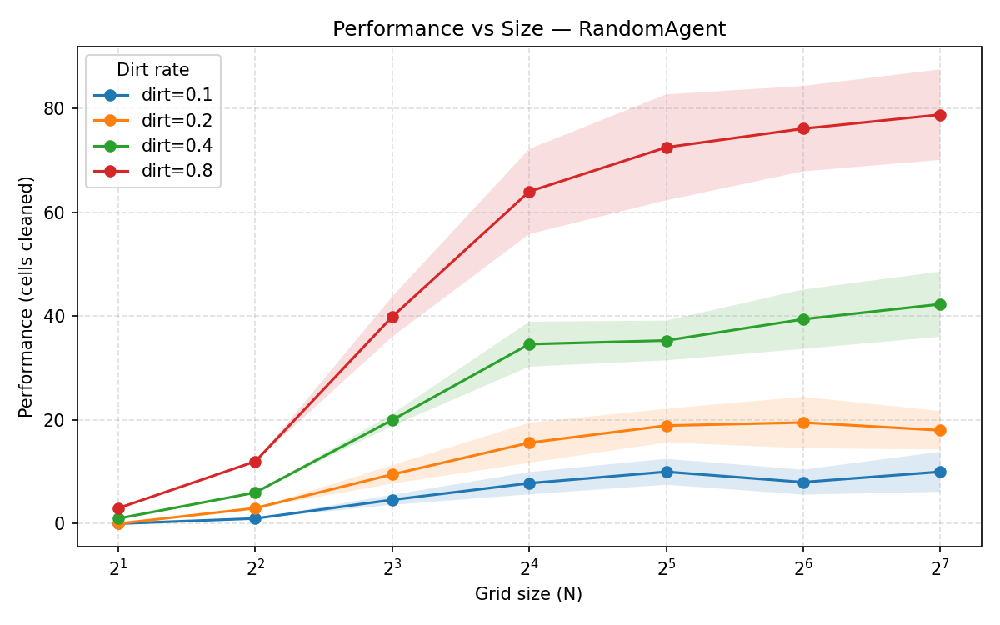
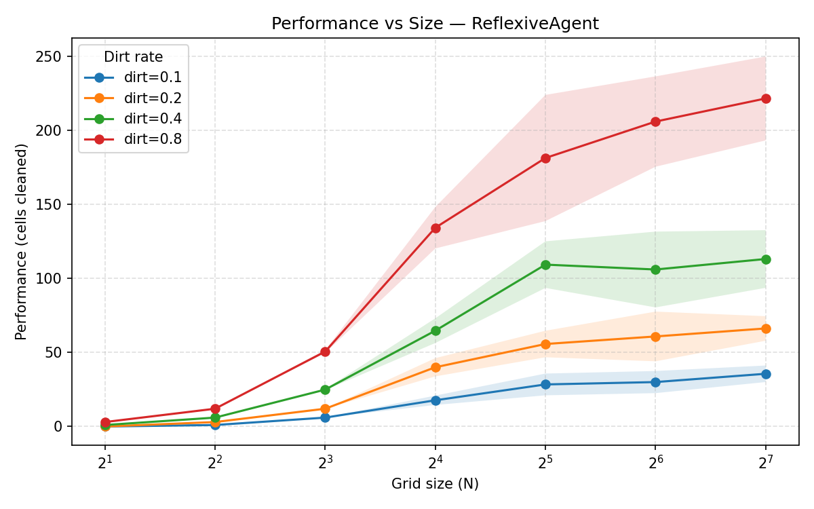
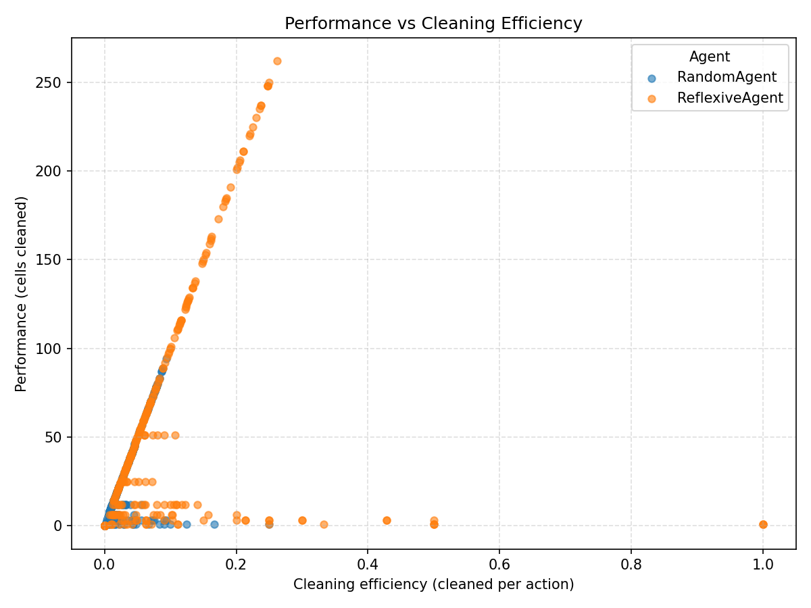

# TP2 – Reporte de agentes racionales en el mundo del aspirador

## Objetivos y fuentes
El objetivo de este trabajo práctico es contrastar agentes racionales simples en el entorno `vacuum-cleaner-world`, evaluando cómo varía su desempeño frente a cambios en el tamaño del mundo y en la tasa de aparición de suciedad.

## Configuración experimental
- **Ambiente:** mundo rectangular de tamaño `size x size`, con tasas de suciedad (`dirt_rate`) en `{0.10, 0.20, 0.40, 0.80}`. Cada escenario se ejecutó con 10 semillas distintas.
- **Agentes probados:** `RandomAgent` (elige acciones al azar) y `ReflexiveAgent` (sigue reglas basadas en la percepción inmediata del tile actual).

## Resultados cuantitativos
### Promedios globales por agente

| Agente | Corridas | Performance promedio | Eficiencia de limpieza | Eficiencia de movimiento | Eficiencia de acción | Success rate promedio | Acciones totales | Tiempo de ejecución (s) |
| --- | --- | --- | --- | --- | --- | --- | --- | --- |
| RandomAgent | 280 | 23.24 | 0.031 | 0.047 | 0.186 | 0.93 | 756.23 | 10.74 |
| ReflexiveAgent | 280 | 56.78 | 0.099 | 0.111 | 0.929 | 0.93 | 668.52 | 10.00 |

### Impacto del tamaño del mundo

| Size | Perf. Random | Perf. Reflexive | Clean Random | Clean Reflexive |
| --- | --- | --- | --- | --- |
| 2 | 1.00 | 1.00 | 0.0337 | 0.1854 |
| 4 | 5.50 | 5.50 | 0.0272 | 0.0983 |
| 8 | 18.50 | 23.38 | 0.0188 | 0.0395 |
| 16 | 30.50 | 64.15 | 0.0305 | 0.0642 |
| 32 | 34.17 | 93.67 | 0.0342 | 0.0937 |
| 64 | 35.75 | 100.67 | 0.0357 | 0.1007 |
| 128 | 37.27 | 109.10 | 0.0373 | 0.1091 |

### Impacto de la tasa de suciedad

| Dirt rate | Perf. Random | Perf. Reflexive | Clean Random | Clean Reflexive |
| --- | --- | --- | --- | --- |
| 0.10 | 5.91 | 16.96 | 0.0120 | 0.0374 |
| 0.20 | 12.07 | 33.96 | 0.0139 | 0.0459 |
| 0.40 | 25.51 | 60.71 | 0.0378 | 0.1367 |
| 0.80 | 49.47 | 115.50 | 0.0605 | 0.1748 |

La tasa de suciedad magnifica las diferencias: el ReflexiveAgent escala casi linealmente porque siempre intenta aspirar cuando detecta suciedad, mientras que el RandomAgent desperdicia acciones desplazándose sin observar el entorno. A dirt_rate 0.80, el reflexivo entrega 2.3× más puntaje y casi 3× más suciedad removida.

## Visualizaciones incluidas
-  — resume la dispersión del puntaje; los cuartiles del ReflexiveAgent se desplazan por completo sobre los del RandomAgent.
-  y  — muestran cómo el puntaje varía según `size` y `dirt_rate`. El mapa del RandomAgent es casi plano más allá de dirt_rate, mientras que el del ReflexiveAgent presenta un gradiente claro al aumentar ambos parámetros.
-  y  — confirman que el ReflexiveAgent sigue ganando puntaje a medida que el mundo crece, mientras que el RandomAgent se estabiliza rápidamente.
-  — cada punto representa una corrida; la nube del ReflexiveAgent se concentra en el cuadrante superior derecho (puntaje y limpieza altos), evidenciando su consistencia.

## Hallazgos destacados
- El diseño reflexivo simple es suficiente para multiplicar la eficiencia de acción por cinco sin aumentar el tiempo de simulación, lo que valida la hipótesis de que “más percepción” equivale a mejor racionalidad.
- A tamaños grandes y alta suciedad, solo el ReflexiveAgent mantiene una tendencia positiva; el RandomAgent actúa como un límite inferior útil para medir mejoras.
- Las acciones totales del RandomAgent crecen porque pasa mucho tiempo moviéndose sin limpiar; esto explica su menor movimiento y acción eficiencia pese a recorrer más casilleros.
