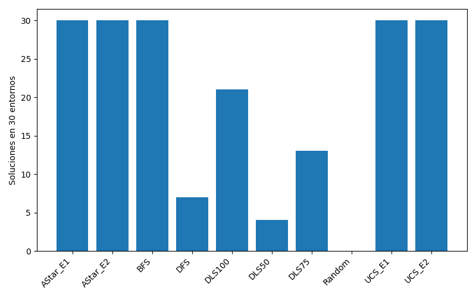
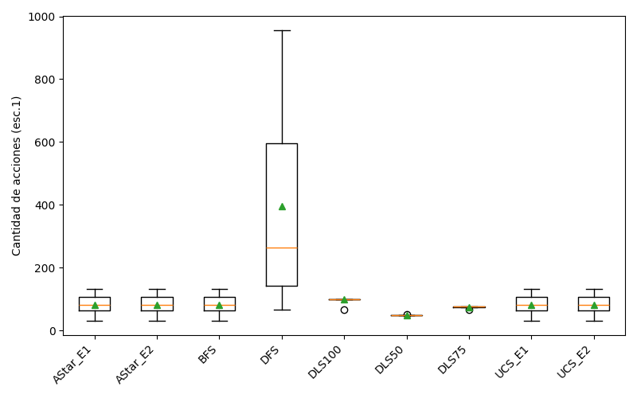
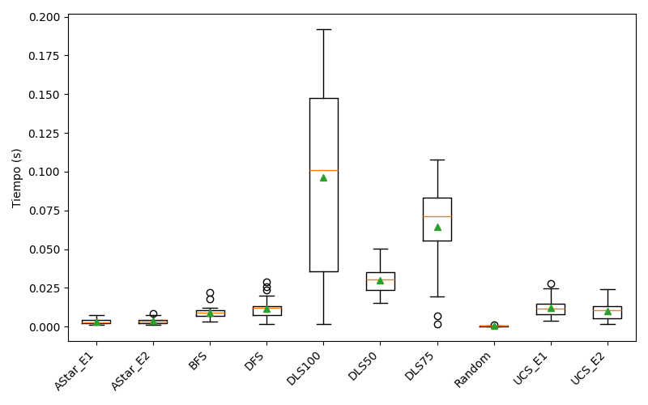
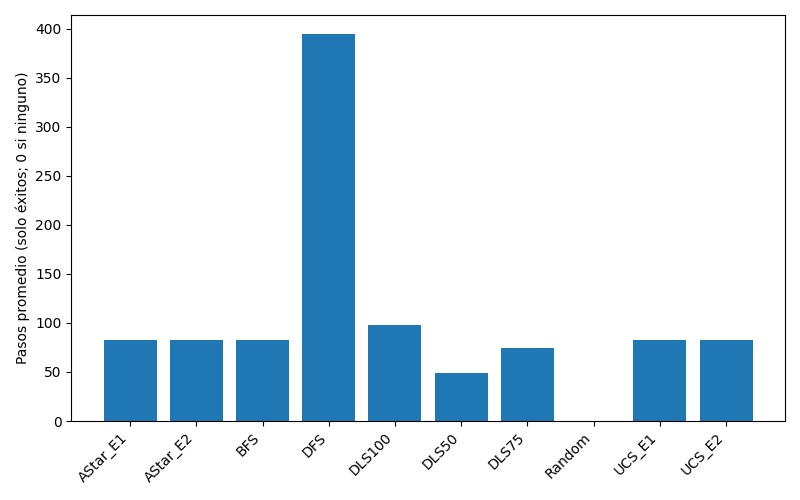
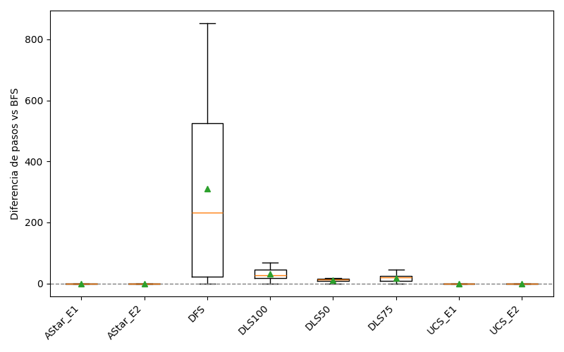
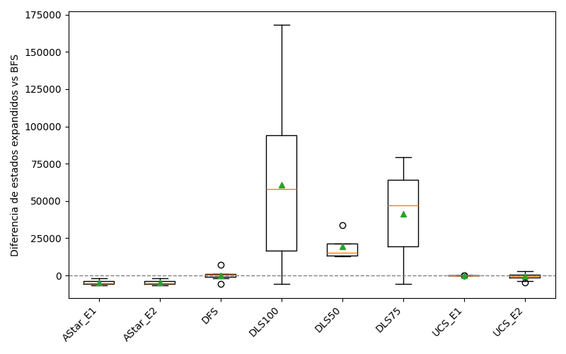
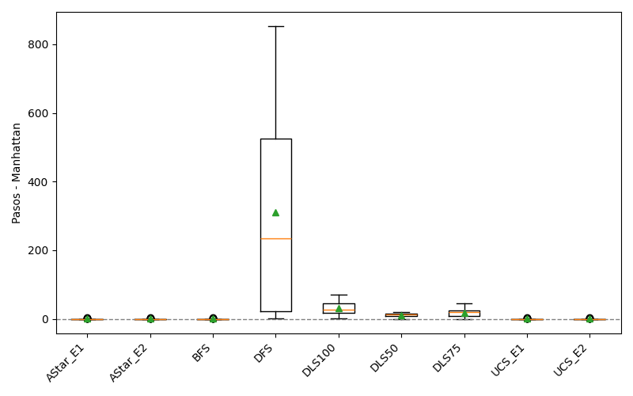

# Reporte de Búsqueda en FrozenLake (100×100)

Evaluamos los algoritmos Random, BFS, DFS, DLS (50/75/100), UCS (Escenarios 1 y 2) y A* (Escenarios 1 y 2) en 30 entornos deterministas (`is_slippery=False`) generados con `generate_random_map_custom`. Cada mapa mide 100×100, tiene probabilidad `p=0.92` de ser transitable y establece un límite de 1000 pasos por episodio.

---

## Análisis de Resultados

### Completitud
- BFS, UCS_E1, UCS_E2, AStar_E1 y AStar_E2 alcanzaron el objetivo en los 30/30 entornos.
- DFS, las variantes DLS y Random fallaron en múltiples mapas y no son completos.

### Optimalidad
- Los boxplots muestran que BFS, UCS y A* obtienen siempre el costo mínimo, tanto en pasos (Escenario 1) como en costo ponderado (Escenario 2).

### Eficiencia (Estados y Tiempo)
- A* explora en promedio ~1.3k estados, mientras que BFS/UCS rondan los ~6k; DFS/DLS requieren órdenes de magnitud mayores.
- Todos los algoritmos óptimos concluyen en milisegundos, pero A* exhibe la menor variabilidad temporal.

### Comparativas Complementarias
- La diferencia de pasos respecto a BFS es nula para A*, confirmando su optimalidad.
- La heurística ponderada de AStar_E2 sigue la distancia Manhattan y reduce más del 75 % de los estados expandidos frente a UCS.

---

## Conclusión y Algoritmo Recomendado
**AStar_E2** es la mejor opción: logra completitud perfecta, garantiza el costo mínimo real del Escenario 2 y, gracias a su heurística Manhattan ponderada, reduce drásticamente los estados explorados sin sacrificar optimalidad. En conjunto, ofrece el mejor equilibrio entre completitud, optimalidad y eficiencia para FrozenLake determinista.
