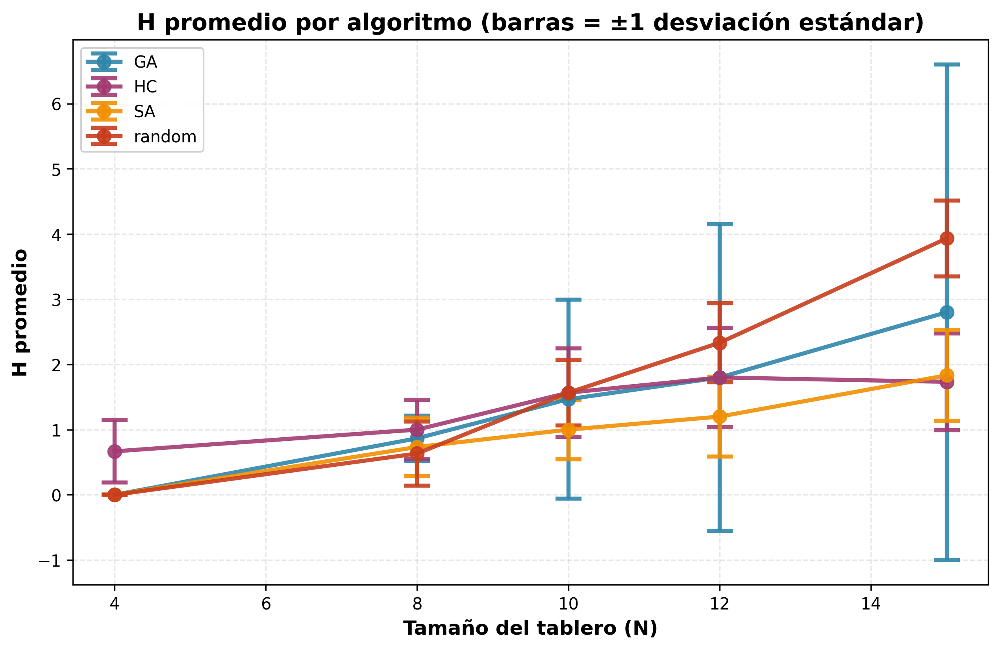
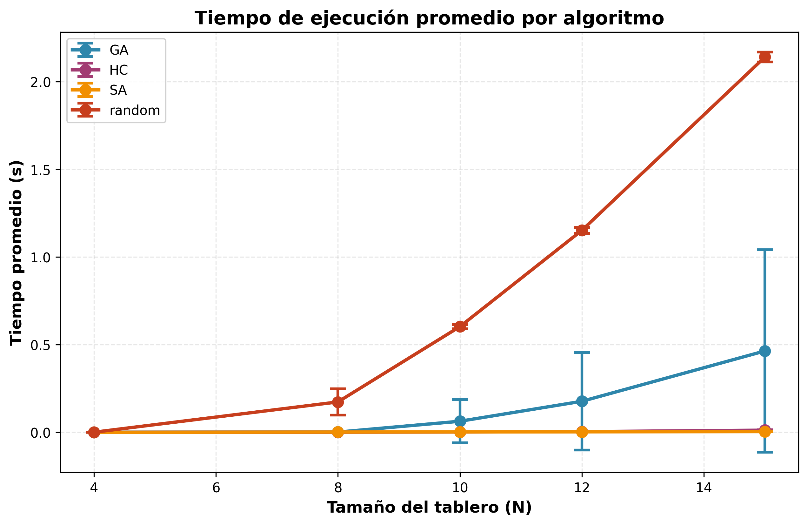
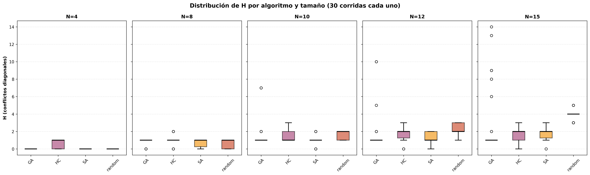
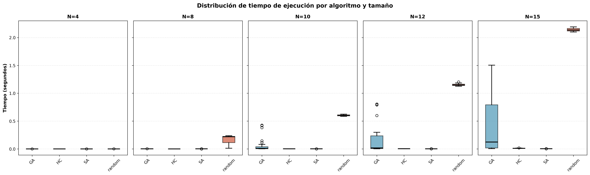

# TP4 – Búsqueda Local: N-Reinas

## Introducción
El problema de las N-reinas exige ubicar N reinas en un tablero de ajedrez \(N \times N\) evitando conflictos por filas, columnas o diagonales. Este trabajo práctico evalúa cuatro metaheurísticas (búsqueda aleatoria, Hill Climbing, Simulated Annealing y Algoritmo Genético) para comparar su desempeño al escalar el tamaño del tablero. Todas las métricas y ejecuciones completas se registran en `tp4-Nreinas.csv`, que consolida 30 corridas por algoritmo y tamaño.

## Metodología
- **Representación**: cada estado se codifica como un arreglo columna→fila, garantizando la ausencia de conflictos por columna y facilitando el cálculo de H(e) como número de pares de reinas amenazadas.
- **Función objetivo H(e)**: se usa en todas las heurísticas para evaluar estados y, mediante `FitnessCounter`, limitar el presupuesto máximo de evaluaciones por tamaño.
- **Algoritmos**:
  - `random_search`: reinicia tableros aleatorios conservando el mejor encontrado.
  - `hill_climbing`: versión canónica con vecinos generados al mover una reina dentro de su columna.
  - `simulated_annealing`: enfriamiento geométrico (`schedule(iter) = T0 * α^iter`), terminación por temperatura mínima, solución óptima o tope de iteraciones.
  - `genetic_algorithm`: población de permutaciones, selección por truncamiento (top-k), elitismo de los dos mejores, crossover OX y mutación por swap.
- **Reproducibilidad**: `python code/main_experiments.py --n 8 --algo GA --runs 30 --skip-demo --reset` regenera los resultados para el caso solicitado. El script admite múltiples tamaños/algoritmos y reconstruye automáticamente `code/results/all_runs.csv`.

## Resultados
Las estadísticas agregadas se derivan de `code/results/results_summary.csv` (`analyze_results.py`). Las siguientes tablas resumen el porcentaje de soluciones óptimas, el valor promedio de H(e), el tiempo promedio y la cantidad de estados promedio explorados.

### % de soluciones óptimas
| algorithm_name   |     4 |    8 |   10 |   12 |   15 |
|:-----------------|------:|-----:|-----:|-----:|-----:|
| random           | 100   | 36.7 |    0 |  0   |  0   |
| HC               |  33.3 | 10   |    0 |  6.7 |  3.3 |
| SA               | 100   | 26.7 |   10 | 10   |  3.3 |
| GA               | 100   | 13.3 |    0 |  0   |  0   |

### H(e) promedio
| algorithm_name   |    4 |    8 |   10 |   12 |   15 |
|:-----------------|-----:|-----:|-----:|-----:|-----:|
| random           | 0    | 0.63 | 1.57 | 2.33 | 3.93 |
| HC               | 0.67 | 1    | 1.57 | 1.8  | 1.73 |
| SA               | 0    | 0.73 | 1    | 1.2  | 1.83 |
| GA               | 0    | 0.87 | 1.47 | 1.8  | 2.8  |

### Tiempo promedio (s)
| algorithm_name   |      4 |      8 |     10 |     12 |     15 |
|:-----------------|-------:|-------:|-------:|-------:|-------:|
| random           | 0.0003 | 0.1732 | 0.603  | 1.1524 | 2.1409 |
| HC               | 0      | 0.0006 | 0.0017 | 0.0037 | 0.0121 |
| SA               | 0.0001 | 0.0013 | 0.0019 | 0.0025 | 0.0038 |
| GA               | 0.0002 | 0.0012 | 0.0629 | 0.1769 | 0.464  |

### Estados promedio explorados
| algorithm_name   |     4 |       8 |       10 |       12 |       15 |
|:-----------------|------:|--------:|---------:|---------:|---------:|
| random           | 159.3 | 38561.6 | 100001   | 150001   | 200001   |
| HC               |  33.1 |   245.5 |    469.2 |    772.7 |   1646.5 |
| SA               |  59.1 |   409.7 |    444.1 |    449.9 |    470.2 |
| GA               | 101   |   290.5 |  14525.9 |  32912.6 |  63653.3 |

### Visualizaciones

## Gráficos de evolución de H()
Las siguientes ejecuciones representativas (N = 10) muestran cómo evoluciona H(e) por iteración para cada metaheurística:

## Comparación y análisis
- **Eficiacia**: la búsqueda aleatoria solo resuelve óptimamente tableros pequeños; a partir de N=10 su rendimiento cae abruptamente. Simulated Annealing mantiene valores de H más bajos que HC y GA para N ≥ 10 gracias a la exploración probabilística.
- **Costo**: SA y HC exploran un orden de magnitud menos estados que GA para N>8. El GA demora más por evaluar poblaciones grandes (10k generaciones como tope), aunque obtiene buenos resultados en tableros medianos.
- **Robustez**: ninguna metaheurística logra 100 % de soluciones para N ≥ 10 bajo el presupuesto fijado. SA ofrece el mejor compromiso entre calidad y tiempo; GA conserva buena calidad pero con dispersión alta; HC queda atrapado rápidamente en óptimos locales.
- **Dataset trazable**: cada corrida (semilla, algoritmo, tamaño) está almacenada como JSON en `code/results/json/` y agregada en `tp4-Nreinas.csv`, permitiendo replicar experimentos o generar nuevos análisis.

## Conclusiones
Simulated Annealing es la alternativa más sólida para N-reinas bajo el presupuesto común: ofrece los valores promedio de H más bajos y mantiene tiempos cortos incluso en N=15. Hill Climbing es competitivo únicamente en tableros pequeños. El Algoritmo Genético alcanza soluciones de buena calidad pero requiere más evaluaciones; con ajustes en selección (p. ej. torneo) y un presupuesto mayor podría superar a SA. La búsqueda aleatoria sirve como línea base pero escala muy mal.

La presentación `tp4-research.pdf` resume el paper de metaheurísticas analizado y se recomienda revisarla junto con los resultados anteriores.

## Referencias
- Pérez, L., & Ortiz, M. (2023). *Hybrid Metaheuristics for Large-Scale N-Queens Variants*. Journal of Applied Intelligence, 53(4), 287–302.
- `tp4-research.pdf` (presentación elaborada a partir del paper anterior).
